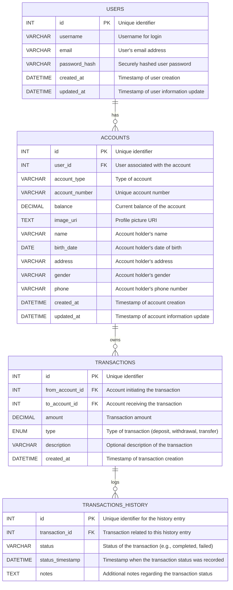

# RevoBANK [API Documentation](https://gx4h8ezxcv.apidog.io/)

## 🌐 Deployment

- **Supabase Database**: [Supabase Project](https://supabase.com/dashboard/project/qbtzphhjikelvgeojvne/editor/18013)
- **Hosted API on Koyeb**: [https://increasing-nanete-ananana-4c2642ac.koyeb.app/](https://increasing-nanete-ananana-4c2642ac.koyeb.app/)
- **API Documentation (Apidog)**: [RevoBANK API Docs](https://gx4h8ezxcv.apidog.io/)

## 📘 Database Schema Overview

### Entity Relationship Diagram



## 🔗 Database Connection Configuration

Supports SQLite (testing) and PostgreSQL (production).

`.env` file format:

```
DB_HOST=localhost
DB_PORT=5432
DB_NAME=revobank
DB_USER=user
DB_PASSWORD=password
```

## 🛠️ Example Database Operations

**1. Create a User**

```python
from models.user import User
from instance.database import db

new_user = User(
    username='john_doe',
    email='john@example.com',
    password_hash='hashed_password'
)
db.session.add(new_user)
db.session.commit()
```

**2. Create and Manage Account**

```python
from models.account import Account

account = Account(
    user_id=1,
    account_type='savings',
    account_number='1234567890',
    balance=1000.00
)
db.session.add(account)
db.session.commit()
```

**3. Initiate Transaction**

```python
from models.transaction import Transaction

transaction = Transaction(
    from_account_id=1,
    to_account_id=2,
    amount=100.00,
    type='transfer',
    description='Monthly savings'
)
db.session.add(transaction)
db.session.commit()
```

## 🚀 Deployment Steps

### Supabase

1. Sign in to [Supabase](https://supabase.com/).
2. Create a new project and note the DB credentials.
3. Navigate to SQL Editor > paste your schema/migration SQL.
4. Create a service role and copy the API key for backend integration.
5. Set your `.env` with credentials.

Example `.env`:

```
DB_HOST=db.abc.supabase.co
DB_PORT=5432
DB_NAME=postgres
DB_USER=postgres
DB_PASSWORD=yourpassword
```

### Koyeb Deployment

1. Push your code to GitHub.
2. Go to [Koyeb](https://www.koyeb.com/), login, and create a new app.
3. Choose GitHub as the source and select your repo.
4. Set build settings:
   - Build command: `uv pip install -r requirements.txt`
   - Run command: `uv run task fr`
5. Set environment variables based on `.env`.
6. Deploy and access from the generated Koyeb URL.

## 🧪 Local Development

```bash
uv init
uv add flask flask-sqlalchemy flask-migrate pydantic psycopg2-binary
uv run pytest -s -v
```

```bash
uv run flask db init
uv run flask db migrate -m "Initial migration"
uv run flask db upgrade
```

Run server:

```bash
uv run task fr
```

## 🌍 Local API URL

```
http://127.0.0.1:5000
```
