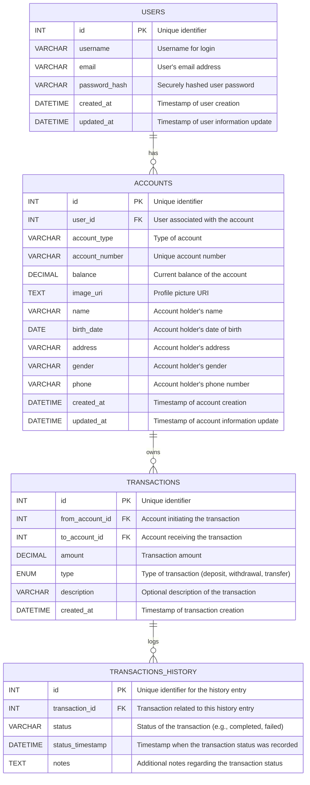

### ERD RevoBANK

## USER

- `id` - `INT` - `PK` - `Unique identifier`
- `username` - `VARCHAR` - `Username for login`
- `email` - `VARCHAR` - `User's email address`
- `password_hash` - `VARCHAR` - `Securely hashed user password`
- `created_at` - `DATETIME` - `Timestamp of user creation`
- `updated_at` - `DATETIME` - `Timestamp of user information update`

## Schema RevoBANK



### Installation

```bash
    # Install the required packages
    uv init
    mv main.py app.py
    uv add flask
    uv add pytest
    uv run pytest -s -v     # run test
```

- for testing : sqlite

```bash
    uv add flask-sqlalchemy flask-migrate psycopg2-binary
```

- for local, production, development : postgresql
- model manager / table manager / ORM / migration : alembic / [lask-migrate](https://flask-migrate.readthedocs.io/en/latest/#)

create a migration/update repository with the following command:

```bash
    $ uv run flask db init # create the migration repository
    $ uv run flask db migrate -m "Initial migration" # create the first migration
    $ uv run flask db upgrade # apply the migration
    $ uv run flask db downgrade # revert the migration
    $ uv run flask db --help # list available commands
    $ uv run load_fixture.py # load dummy data
    $ rm -rf migrations # remove the migration repository
```

```bash
    docker compose up -d   # run docker
```

- implement .env variables in a .env file
- konsep rollback and commit
- implement pagination
- Optimize Queries: Avoid N+1 queries, use eager loading in SQLAlchemy.
- catat history perbankan (mutasi rekening)
